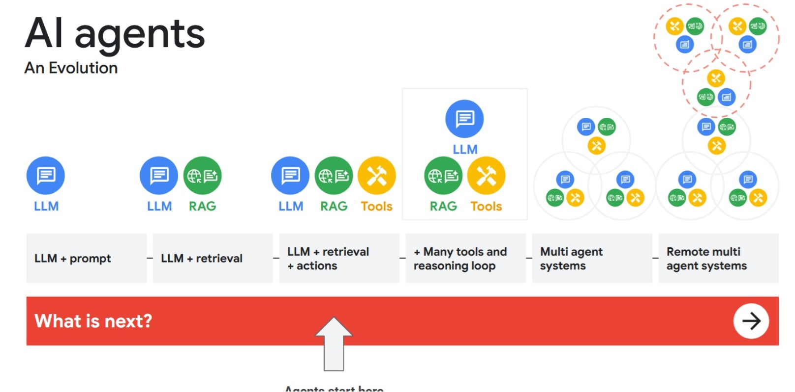
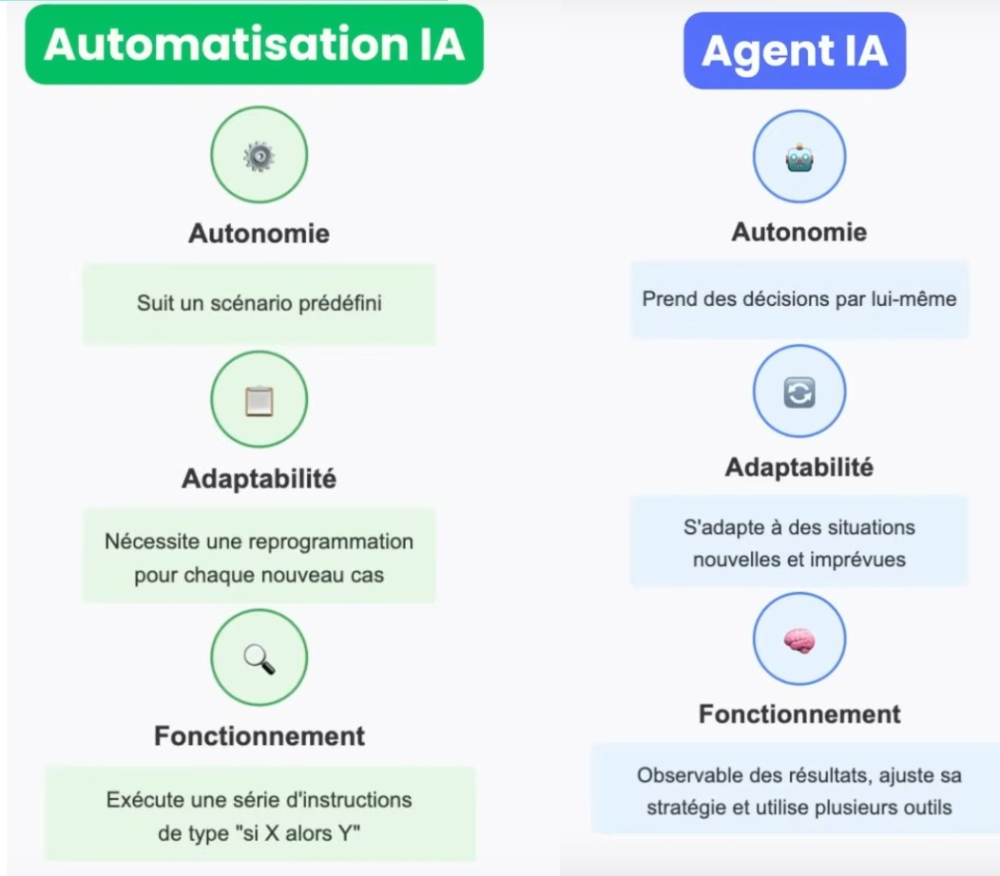
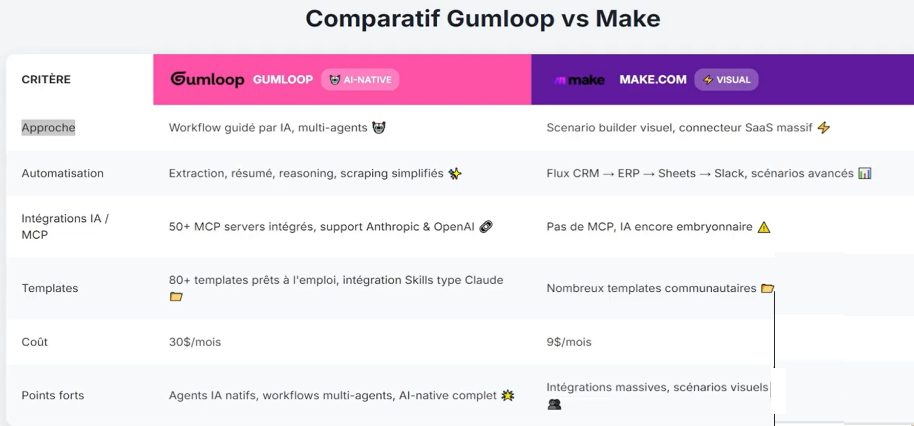
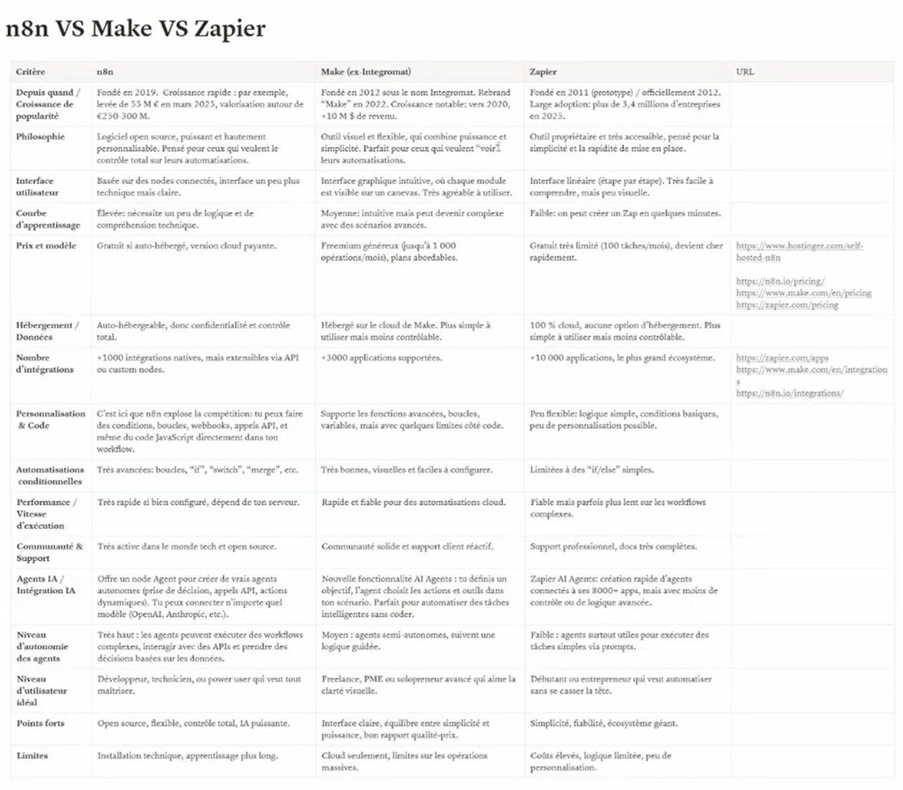
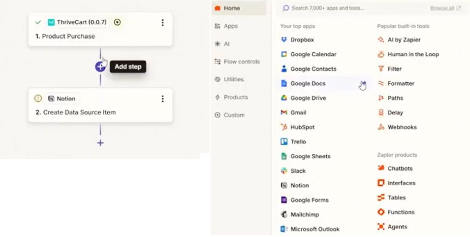
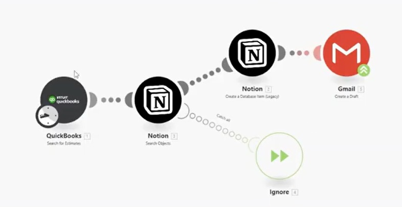
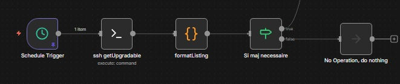
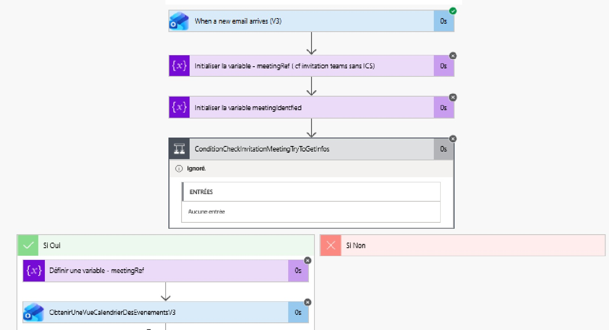
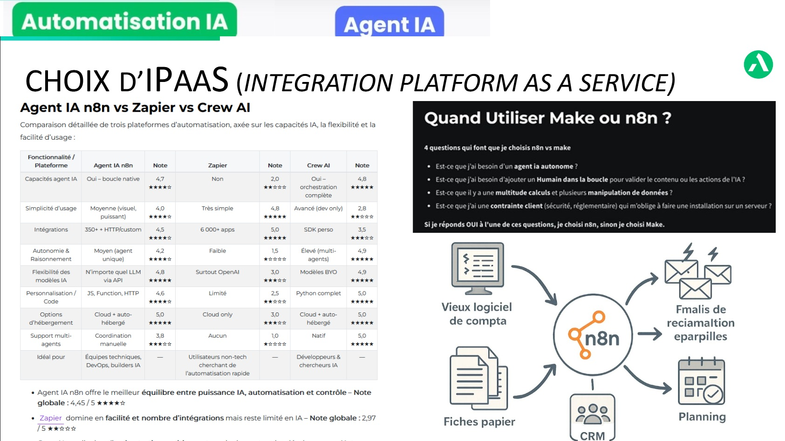
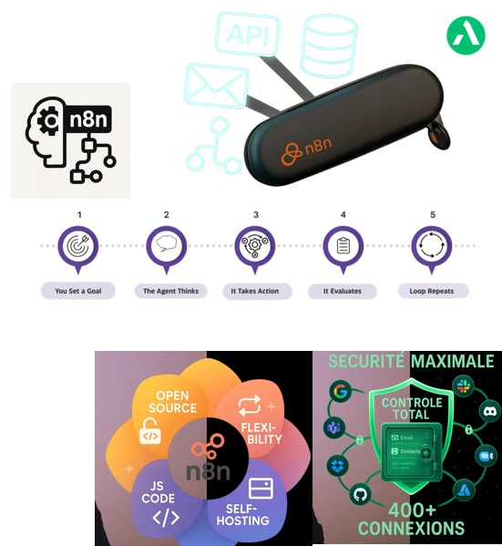

# Module 3 : Automatisation et structuration des projets avec l'IA

**Version** : 2.0.2
**Date de dernière mise à jour** : 2026-05-26
**Auteur** : Bruno Celle [bruno.celle@astek.net](mailto:bruno.celle@astek.net)

---

## Objectifs d'apprentissage

À l'issue de ce module, les participants seront capables de :

1. **Créer templates de prompts réutilisables** pour standardiser la production de contenu.
2. **Concevoir des workflows automatisés** (Zapier, Make, N8N, Gumloop) pour connecter les outils.
3. **Industrialiser l'analyse de la User Research** pour traiter des volumes massifs de feedback.

---

## 1. Introduction : Du "Bricolage" au "Product Operating System"

Ne plus voir l'IA comme un gadget, mais comme le système d'exploitation de votre équipe produit.

### 1.1 Les 3 niveaux d'automatisation

1. **Niveau Personnel (IA Assistante)** : Custom GPTs, Prompts réutilisables.
  - *Gain* : Productivité individuelle (+30%).
2. **Niveau Équipe (Workflow Automation)** : Zapier, Make, Notifications.
  - *Gain* : Fluidité des processus, moins d'erreurs.
3. **Niveau Système (Product Intelligence)** : Analyse auto de feedback, génération de roadmap dynamique.
  - *Gain* : Capacité de scale, insights stratégiques.

*Figure 3.1 : La trajectoire d'adoption des agents IA au sein des équipes produit*

*Figure 3.4 : Transition de l'automatisation classique vers les agents d'IA autonomes*

---

## 2. Niveau 1 : Prompts Réutilisables et Assistants (Custom GPTs)

Pourquoi réécrire le même contexte à chaque fois ? Créez des spécialistes.

### 2.1 Qu'est-ce qu'un Custom GPT ?

Une version de ChatGPT pré-configurée avec :

- **Instructions spécifiques** (Persona, Ton, Format).
	  ASPeCCTf :Action, Steps, Persona,(Examples), Context, Constraints, Template, (Finally)
- **Connaissance** (Documents uploadés : PDF, Excel, Specs).
- **Actions** (Capacité à appeler des API externes - *Avancé*).

### 2.2 Cas d'usage pour PO/PM

#### A. Le "Tech Spec Writer"

- **Rôle** : Transforme une User Story fonctionnelle en spécifications techniques détaillées.
- **Knowledge** : Documentation d'architecture, API Swagger, Guidelines de code.
- **Instruction** : "Tu es Tech Lead. À partir de cette US, liste les endpoints à créer, le schéma de BDD et les cas d'erreurs."

#### B. Le "Guardian of the Backlog"

- **Rôle** : Vérifie la qualité des tickets avant le sprint planning.
- **Knowledge** : Definition of Ready (DoR), INVEST criteria.
- **Instruction** : "Analyse ce ticket. Est-il INVEST ? Manque-t-il des critères d'acceptation ? Note-le sur 10."

#### C. Le "User Voice Analyst"

- **Rôle** : Expert de vos personas.
- **Knowledge** : Interviews utilisateurs, Personas PDF, Résultats de sondages.
- **Instruction** : "Je suis PO. Comment notre persona 'Marie la comptable' réagirait à cette nouvelle feature ?"

----------------------- ✄ TP 1 (Release Notes) ✄ -----------------------

---

## 3. Niveau 2 : Automatisation de Workflows (Rovo, Zapier, Make, Gumloop & N8N)

Connecter les outils entre eux pour que l'information circule sans copier-coller.

### 3.1 Le paysage des outils

Il existe aujourd'hui plusieurs acteurs majeurs pour automatiser vos tâches, du plus simple au plus puissant :

| **Rovo**    | **"L'automatisation par l'IA"**. Une solution nouvelle génération pour la suite Atlassian (Jira, Confluence...) où l'IA est au cœur du flux.                                                                                                                                           |
| ----------- | -------------------------------------------------------------------------------------------------------------------------------------------------------------------------------------------------------------------------------------------------------------------------------------- |
| Outil       | Description                                                                                                                                                                                                                                                                            |
| **Zapier**  | **"Si ceci, alors cela"**. Très linéaire et facile d'accès. Idéal pour débuter.                                                                                                                                                                                                        |
| **Make**    | **"Programmation visuelle"**. Permet des scénarios complexes avec des boucles et des conditions.                                                                                                                                                                                       |
| **Gumloop** | **"L'automatisation par l'IA"**. Une solution nouvelle génération orientée vers le traitement des données et des tâches complexes par LLM.                                                                                                                                             |
| **N8N**     | **L'automatisation souveraine avec IA native**. Permet de concevoir visuellement des agents IA complexes (avec mémoire, RAG et outils) et de les connecter à vos applications métiers. Idéal pour des flux sécurisés (RGPD) et extensibles grâce à son modèle low-code et open-source. |

*Figure 3.2 : Comparatif d'outils d'automatisation (Gumloop vs Make)*

*Figure 3.2bis : Comparatif N8N, Make, Zapier*

*Figure 3.x : look Zapier*
 

*Figure 3.x : look Make*
 
 

*Figure 3.x : look N8N*

 

*Figure 3.x : look PowerAutomate*

*Figure 3.3 : Positionnement des plateformes d'intégration iPaaS*

----------------------- ✄ TP 2 (Zapier / Gumloop) ✄ -----------------------

---

### 3.2 N8N et l'écosystème "Advanced AI"

Contrairement aux outils d'automatisation traditionnels (Zapier/Make) qui traitent l'IA comme un simple connecteur d'API ("envoyer le prompt à OpenAI et attendre la réponse"), N8N propose une architecture IA native basée sur des nœuds spécialisés (sous-ensemble inspiré de LangChain) :

1. **Nœud "AI Agent"** : Le chef d'orchestre. Vous lui donnez des instructions de rôle (System Prompt) et vous lui associez des **outils** (Tools) et de la **mémoire** (Memory). L'agent décide lui-même quelles actions effectuer et dans quel ordre pour atteindre son objectif.
2. **Nœuds "Tools" (Outils)** : Permettent à l'agent IA d'interagir avec le monde extérieur (lire/écrire dans Jira, envoyer un email, appeler un webhook, exécuter du code Javascript, etc.).
3. **Nœuds "Memory" (Mémoire)** : Donnent à l'agent une persistance de contexte (par exemple, retenir le fil d'une discussion avec un utilisateur sur plusieurs messages).
4. **Nœuds "Vector Store" (Base vectorielle)** : Permettent de faire du RAG (Retrieval-Augmented Generation) en connectant l'agent à une base de connaissances (PDF, Confluence, Notion) pour qu'il réponde à partir d'informations internes et fiables.

Cette approche visuelle permet à un PO ou PM de concevoir de véritables prototypes d'agents IA fonctionnels en moins d'une heure, sans écrire une ligne de code, tout en gardant le contrôle sur la logique métier.

### 3.3 Le protocole MCP (Model Context Protocol) et N8N

**Qu'est-ce que le MCP ?**
Le **Model Context Protocol (MCP)** est un standard ouvert permettant aux modèles d'IA (comme Claude Desktop) de se connecter de manière sécurisée et uniforme à des sources de données locales ou distantes, et à des outils externes.

**Quel rapport avec N8N ?**
N8N intègre nativement un serveur MCP. Cela signifie que vous pouvez connecter votre assistant IA (par exemple Claude Desktop installé en local) directement à votre instance N8N :
- L'IA peut lire, modifier ou exécuter vos workflows N8N.
- L'IA peut déclencher des automatisations complexes à votre demande, directement depuis la fenêtre de discussion.
- Cela transforme votre assistant de simple générateur de texte en un copilote d'action, capable d'agir directement sur vos outils de gestion de projet (Jira, Notion, Slack).

*Figure 3.5 : Architecture et interactions des workflows N8N*

---

## 4. Niveau 3 : Industrialiser la User Research

Comment traiter 500 feedbacks par semaine ?

### 4.1 Le Pipeline de Feedback Automatisé

**Source** : Typeform, Intercom, App Store Reviews, Emails support.

**Workflow classique** :

1. **Trigger** : Nouveau feedback reçu.
2. **Analyse Sémantique (OpenAI)** :
  - *Sentiment* : Positif/Négatif/Neutre.
  - *Tagging* : Bug, Feature Request, UX, Pricing.
  - *Feature liée* : "Recherche", "Login", "Paiement".
3. **Routing** :
  - Si "Bug Critique" → Alerte Slack #Devs.
  - Si "Feature Request" → Ajout dans Airtable "Idées".
4. **Stockage** : Tout va dans une base de données "Insights" ou des outils dédiés comme [Productboard AI](https://www.productboard.com) ou [Dovetail AI](https://dovetail.com/ai/).

### 4.2 Interroger la base de connaissance

Une fois les données dans la base, utilisez l'IA pour demander :
*"Quels sont les 5 problèmes les plus fréquents sur le module Paiement le mois dernier ?"*

*(Note: Pour les documentations techniques complexes générées automatiquement, des outils comme [Kiro Code2Doc](https://kiro.dev) facilitent l'industrialisation).*

----------------------- ✄ TP 3 (N8N & Feedback) ✄ -----------------------

---

**Note** : Ce contenu est développé par [Astek](https://www.astek.net) et sera régulièrement mis à jour pour refléter l'évolution des outils et pratiques IA.