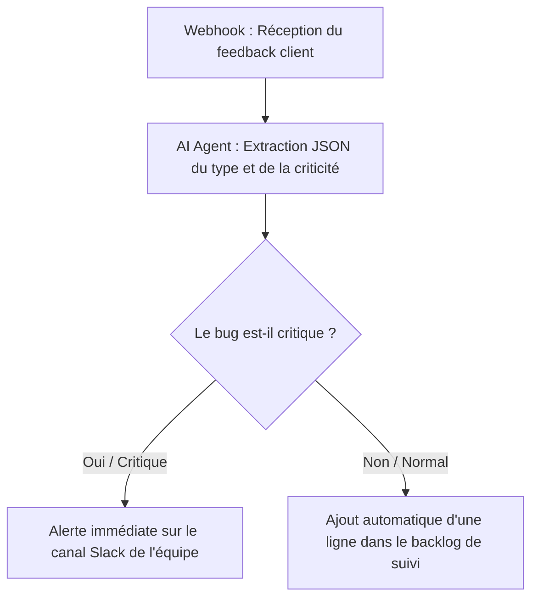

# Exercices Module 3 : Automatiser vos tâches répétitives avec l'IA (Cas d'étude TaskFlow)

**Durée totale** : 2 heures (3 exercices + débrief)  
**Format** : Travail individuel avec débrief collectif  
**Outils nécessaires** : 
- Compte Zapier ou Gumloop gratuit
- Accès à [Vibe de Mistral](https://chat.mistral.ai) (recommandé et préconisé par rapport à ChatGPT), [ChatGPT](https://chatgpt.com), [Claude](https://claude.ai) ou Copilot

---

## 🎯 Objectif pédagogique

Expérimenter **3 niveaux d'automatisation** dans votre quotidien de PO/PM pour optimiser le traitement des tâches récurrentes du projet **TaskFlow** :

- **Niveau 1** : Créer un prompt template réutilisable pour générer instantanément les Release Notes de fin de sprint à partir d'extraits bruts de votre backlog CSV.
- **Niveau 2** : Designer logiquement un workflow d'intégration No-Code (Zapier/Gumloop) pour capturer les feedbacks des bêta-testeurs de TaskFlow.
- **Niveau 3** : Configurer un workflow d'agent de tri intelligent (N8N) utilisant un LLM pour analyser, catégoriser et router les anomalies reçues vers l'équipe de développement.

---

## 📝 Exercice 1 : Automatisation SIMPLE - Template de Release Notes réutilisable

**Durée** : 20 minutes  
**Objectif** : Concevoir un prompt template structuré avec la méthode ACTF permettant d'automatiser la rédaction des Release Notes hebdomadaires.

### Le problème

À chaque fin de sprint, vous devez compiler les tickets fermés dans le backlog de TaskFlow pour en faire un résumé clair et attrayant destiné aux utilisateurs finaux et aux clients.

**Processus manuel classique** :
1. Extraire la liste des tickets terminés (Jira / GitLab / CSV).
2. Trier les tickets (Nouvelles fonctionnalités / Corrections de bugs / Recherches).
3. Traduire le jargon technique des développeurs en bénéfices utilisateurs.
4. Rédiger le document et y ajouter de la mise en forme (emojis, puces).

**⏱️ Temps nécessaire** : 30 à 45 minutes par sprint.

---

### ✅ Mission : Créer et tester votre prompt template avec les données du Sprint 6

#### Étape 1 : Analyser les tickets fermés du Sprint 6 (Données réelles)

Voici les tickets bruts fermés lors du Sprint 6 que vous devez synthétiser :

```text
- US-561 [User Story] : Envoyer un digest hebdomadaire des tâches en retard sur Slack
- BUG-562 [Bug] : Liens cassés dans la notification Slack si le titre contient des caractères spéciaux
- US-563 [User Story] : Intégration Slack multi-canal (notifier différents canaux selon le projet)
- BUG-564 [Bug] : Lenteur de l'application lors de l'envoi de notifs Slack (appel bloquant)
- US-565 [User Story] : Permettre d'interagir avec la tâche directement depuis Slack (bouton Terminer)
- US-576 [User Story] : Mettre en cache les pièces jointes légères pour consultation hors-ligne
- BUG-577 [Bug] : Conflit de version local / distant lors de la première synchronisation
- Spike-633 [Spike] : Modélisation technique des concepts de capacité et charge de travail
```

---

#### Étape 2 : Configurer le prompt template ACTF

Rédigez un prompt réutilisable en utilisant les variables `[TICKETS]`, `[VERSION]`, et `[DATE]`. 

*Exemple de prompt structuré à copier-coller dans votre IA :*

```text
Tu es un Product Owner senior sur le projet TaskFlow. Ta tâche est de rédiger les Release Notes officielles pour nos utilisateurs finaux à partir de la liste brute de tickets fermés ci-dessous.

CONSIGNES DE RÉDACTION :
1. Catégorise les tickets en 3 sections : 
   - ✨ Nouvelles fonctionnalités (pour les User Stories apportant de la valeur visible)
   - 🐛 Corrections de bugs (pour les anomalies résolues)
   - 🔍 Études & Recherches (pour les Spikes et analyses techniques)
2. Traduis le jargon technique des tickets de manière simple et positive pour l'utilisateur final.
3. Ne montre pas les identifiants techniques bruts dans le texte final, mais garde la référence sous le format [TF-XXX] à la fin de chaque puce.
4. N'invente aucune fonctionnalité qui ne figure pas dans la liste fournie.

DONNÉES DU SPRINT :
- Version : Version 2.6.0
- Date de livraison : 2026-06-15
- Tickets bruts :
[COLLER ICI LA LISTE DE TICKETS DU SPRINT 6 CI-DESSUS]

Génère la note de version en suivant strictement ce formatage :
📦 Version [VERSION] - [DATE]
(Sections avec emojis appropriés, listes à puces claires et espacées).
```

---

#### Étape 3 : Tester et valider le résultat

Vérifiez que l'IA a bien :
- Classé le bug de lenteur `BUG-564` sous "Corrections de bugs" (en traduisant "appel bloquant" par "chargement accéléré").
- Classé la modélisation technique `Spike-633` sous "Études & Recherches" ou "Améliorations techniques".
- Conservé les références sous le format attendu (ex: `[TF-561]`).

---

## ⚙️ Exercice 2 : Design de Workflow No-Code (Zapier ou Gumloop)

**Durée** : 25 minutes  
**Niveau** : ⭐⭐ Intermédiaire  
**Objectif** : Concevoir graphiquement la logique d'un workflow automatisé pour centraliser les avis utilisateurs.

### Le scénario

Les bêta-testeurs de TaskFlow vous envoient des retours sur l'application depuis plusieurs canaux (emails, Slack, formulaires). Vous souhaitez centraliser et standardiser ces retours automatiquement.

### ✅ Mission : Cartographier et designer la "Feedback Machine" de TaskFlow

#### Étape 1 : Le flux logique (Trigger -> Action)

Vous allez formaliser le flux suivant :
1. **Trigger (Déclencheur)** : Réception d'un nouveau retour via un Google Formulaire (champs : Titre de l'idée, Description, Catégorie estimée par l'utilisateur).
2. **Action 1 (IA - Optionnelle via Zapier AI / Gumloop)** : Demander à l'IA de synthétiser le retour en 1 phrase et de lui attribuer une étiquette correspondant aux labels de TaskFlow (ex: `Feature::A - Slack`, `Feature::B - Offline`).
3. **Action 2 (Destination)** : Créer automatiquement une carte dans votre outil de suivi (ex : Notion Database ou Trello) avec les données propres et formatées.

#### Étape 2 : Création du prototype No-Code

1. Connectez-vous sur Zapier ou Gumloop.
2. Tentez de lier un formulaire de test (Google Forms) à une boîte email ou une feuille de calcul Google Sheets pour valider la transmission du déclencheur.
3. Si vous ne disposez pas d'API configurée, dessinez le diagramme de flux détaillé décrivant chaque étape technique, les variables transmises et les filtres logiques de sécurité.

---

## ⚙️ Exercice 3 : Automatisation AVANCÉE - Tri intelligent de bugs et routage de Feedback avec N8N

**Durée** : 45 minutes  
**Niveau** : ⭐⭐⭐ Avancé (Low-Code / IA native)  
**Objectif** : Configurer un agent de triage automatisé capable de classifier les anomalies clients et d'alerter l'équipe en temps réel.

### Le scénario

Chaque jour, des dizaines de retours utilisateurs et rapports de pannes atterrissent dans la boîte de support de TaskFlow. Le PO passe beaucoup de temps à les lire et à les copier manuellement dans le backlog.

### ✅ Mission : Créer votre "Triage Agent" sur N8N

Vous allez concevoir le workflow suivant :
`Webhook (Réception du message)` -> `AI Agent (Analyse LLM + Structuration JSON)` -> `IF / Switch (Aiguillage)` -> `Actions de sortie (Slack urgent / Google Sheets standard)`



#### Étape 1 : Accès à N8N

1. Connectez-vous sur votre instance N8N (locale ou N8N Cloud).
2. Créez un nouveau workflow vide.

#### Étape 2 : Le Webhook (Trigger)

1. Ajoutez un nœud **Webhook** paramétré en `POST` avec le chemin `taskflow-triage`.
2. Ce webhook recevra des requêtes de test contenant le message utilisateur sous la forme :
   `{ "feedback": "Texte saisi par le client" }`

#### Étape 3 : L'IA de classification (LLM Node)

1. Connectez le Webhook à un nœud **AI Agent** ou **Basic LLM Chain**.
2. Associez-lui un modèle de langage (OpenAI, Anthropic, Mistral ou un modèle d'évaluation).
3. Rédigez les instructions système (System Prompt) de l'Agent en vous appuyant sur la méthode **ACTF** :

```text
Tu es l'agent de triage automatique du backlog TaskFlow. Tu analyses les retours clients reçus et extrais les informations structurées suivantes au format JSON :
{
  "type": "Bug" (si c'est un dysfonctionnement) ou "Feature Request" (si c'est une proposition d'amélioration) ou "Question" (si c'est une demande d'aide),
  "priority": "Critique" (si l'application crashe, freeze ou que le paiement est bloqué) ou "Normal" (bug mineur ou suggestion importante) ou "Basse" (simple question ou idée d'amélioration mineure),
  "feature_concernee": "Feature::A - Slack" (si concerne Slack) ou "Feature::B - Offline" (si concerne le mode hors-ligne) ou "Feature::C - Templates" (si concerne les modèles) ou "General" (si non déterminé),
  "resume_developpeur": "Un résumé technique clair et concis de 10 mots maximum en français",
  "alerte_immediate": true (si la priorité est Critique) ou false (dans les autres cas)
}

FEEDBACK À ANALYSER :
{{ $json.body.feedback }}
```

#### Étape 4 : Le nœud de décision (IF)

1. Ajoutez un nœud **IF** après le bloc IA.
2. Configurez la condition : `alerte_immediate` est égal à `true`.

#### Étape 5 : Les actions de sortie

1. **Branche VRAIE (Urgence)** : Connectez un nœud **Slack** (ou Teams/Gmail) pour envoyer un message sur le canal `#tech-alerts` (ex: `"🚨 BUG CRITIQUE DÉTECTÉ sur TaskFlow : [Résumé]. Action requise immédiate !"`).
2. **Branche FAUSSE (Backlog)** : Connectez un nœud **Google Sheets** (ou Notion/Jira) pour enregistrer automatiquement les retours triés dans un tableau de backlog avec les colonnes : `Type`, `Priority`, `Feature`, `Résumé`.

#### Étape 6 : Test en conditions réelles

Activez le mode écoute (Listen for test event) et simulez deux scénarios :
* **Test 1 (Normal)** : `"J'aimerais bien pouvoir exporter mon Gantt sur Excel, ce serait pratique pour mes réunions."`
  * *Résultat attendu :* Classé comme `Feature Request`, priorité `Basse`, routé vers le Google Sheets.
* **Test 2 (Critique)** : `"L'application crashe totalement avec un écran blanc dès que j'essaie de me synchroniser hors-ligne dans le train !"`
  * *Résultat attendu :* Classé comme `Bug`, priorité `Critique`, alerte_immediate `true`, alerte Slack déclenchée.

---

## 🎓 Synthèse : Tableau de ROI de vos automatisations

| Niveau | Approche | Cas d'usage TaskFlow | Temps de configuration | Gain estimé par sprint | ROI annuel |
| :--- | :--- | :--- | :--- | :--- | :--- |
| **⭐ Simple** | Prompt Template ACTF | Compilation des Release Notes | 10 minutes | 30 minutes | ~15 heures / an 🚀 |
| **⭐⭐ Intermédiaire** | Workflow Zapier / Gumloop | Collecte de feedbacks utilisateurs | 30 minutes | 1 heure / mois | ~1,5 jour / an |
| **⭐⭐⭐ Avancé** | Workflow N8N + LLM Agent | Triage et routage d'anomalies | 45 minutes | 8 heures / mois | ~12 jours / an ⚡ |

---

## 📌 Rappels importants

> [!IMPORTANT]
> **Consistance des données** : L'IA ne peut trier correctement que si vous lui fournissez une liste claire de vos libellés de features (ex: `Feature::A - Slack`, `Feature::B - Offline`). Si vous changez le nom d'un label dans votre backlog, mettez immédiatement à jour le prompt système de votre agent N8N.

> [!WARNING]
> **Garder l'humain dans la boucle** : L'automatisation trie et documente, mais elle ne résout pas le problème. Validez régulièrement la boîte de réception pour détecter d'éventuelles erreurs de classification de l'IA (faux négatifs critiques).

> [!CAUTION]
> **Gouvernance et Sécurité (Accord Projet)** : Avant de connecter un webhook ou un outil comme Zapier/N8N aux bases de données de votre entreprise, assurez-vous d'avoir l'autorisation écrite des responsables de la sécurité de votre organisation (Accord Projet). Ne faites pas transiter de données clients sensibles sur des instances IA gratuites non sécurisées.
