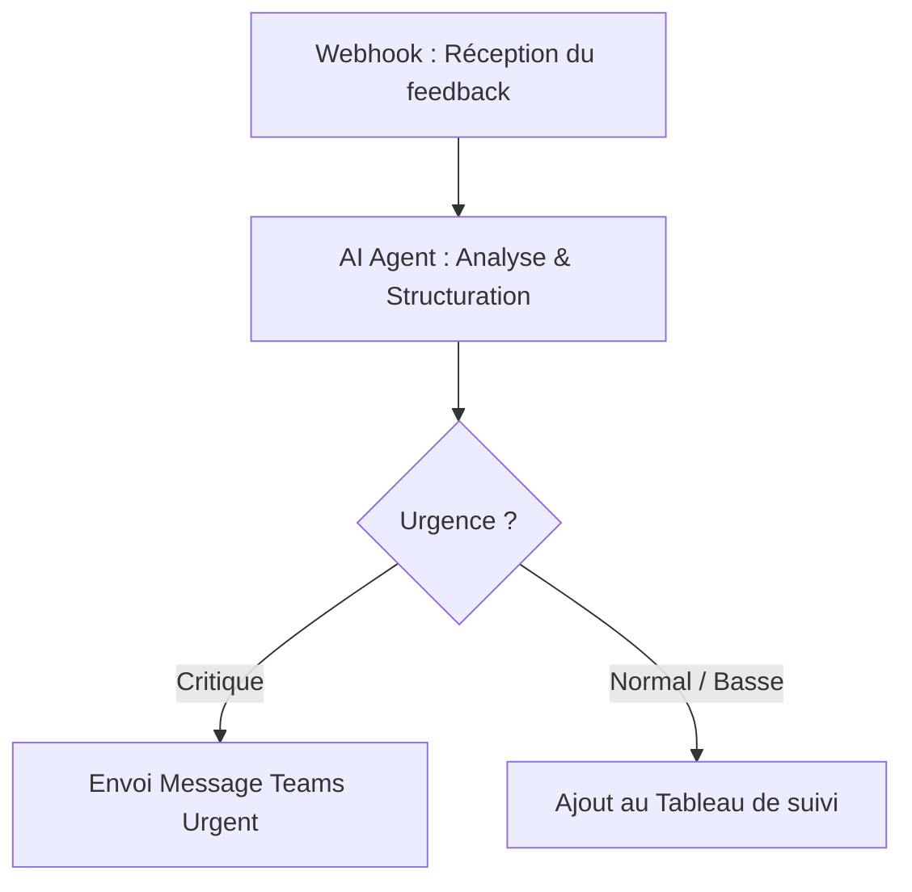

# Exercices Module 3 : Automatiser vos tâches répétitives avec l'IA

**Durée totale** : 2 heures (2 exercices + débrief)  
**Format** : Travail individuel avec débrief collectif  
**Outils nécessaires** : 
- Compte Zapier gratuit (à créer avant la session)
- Accès à [Vibe de Mistral](https://chat.mistral.ai) (anciennement Le Chat - recommandé et préconisé par rapport à ChatGPT), [ChatGPT](https://chatgpt.com), [Claude](https://claude.ai) ou Copilot
- **Pour les apprenants avancés (optionnel)** :
  - N8N local (ou compte Cloud d'évaluation gratuite)
  - Installation locale de N8N
  - Liaison avec le serveur MCP de Claude Desktop


---

## 🎯 Objectif pédagogique

Comprendre et expérimenter **3 niveaux d'automatisation** pour libérer du temps sur les tâches répétitives :
- **Niveau 1** : Automatisation "soft" avec prompts réutilisables
- **Niveau 2** : Automatisation "technique" avec workflows Zapier (No-Code simple)
- **Niveau 3** : Automatisation "IA-native" avec workflows N8N + LLM (Low-Code orienté souveraineté)

**Principe** : Commencer simple, puis progresser vers des automatisations plus avancées.

---

## 📝 Exercice 1 : Automatisation SIMPLE - Template de contenu réutilisable

**Durée** : 20 minutes  
**Objectif** : Créer un prompt template pour automatiser la génération de Release Notes.

### Le problème

Chaque vendredi, vous devez rédiger les **Release Notes** de la semaine pour informer vos utilisateurs et parties prenantes (stakeholders) des nouveautés.

**Processus actuel (manuel)** :
1. Récupérer la liste des tickets complétés dans Jira ou GitHub.
2. Les catégoriser manuellement (Features / Améliorations / Bugs).
3. Rédiger des descriptions claires et orientées utilisateur.
4. Structurer avec des emojis et du formatage.
5. Relire et corriger
6. Publier

**⏱️ Temps nécessaire** : 30 minutes.  

**😰 Problèmes** :
- Chronophage et répétitif
- Risque d'oubli (de tickets)
- Formulation variable selon la fatigue
- Pas de standardisation

---

### ✅ Mission : Créer votre prompt template réutilisable

#### **Étape 1** : Analyser les données brutes (2 min)

Voici les tickets complétés cette semaine :

```text
PROJ-245 : Ajout du mode sombre pour réduire fatigue oculaire
PROJ-251 : Export des rapports en format PDF avec branding personnalisé  
PROJ-189 : Temps de chargement du dashboard réduit de 40%
PROJ-312 : Correction du crash lors de l'upload de fichiers >10MB
PROJ-318 : Correction de l'affichage des dates en format US
PROJ-267 : Intégration Slack pour notifications temps réel
```

**Sans automatisation**, vous devriez :
- Identifier le type de chaque ticket (Feature/Amélioration/Bug)
- Reformuler pour l'utilisateur final
- Organiser par catégorie
- Ajouter les emojis appropriés

---

#### **Étape 2** : Construire votre prompt template (10 min)

Créez un prompt réutilisable (en utilisant la structure **ACTF** vue en cours) qui transforme automatiquement vos données brutes en Release Notes prêtes à être publiées :

```
Tu es un Product Owner qui rédige des Release Notes pour les utilisateurs.

FORMAT STANDARD DE SORTIE :
📦 Version [VERSION] - [DATE]

✨ Nouvelles fonctionnalités
• [CODE-XXX] Description courte orientée utilisateur (bénéfice clair)

🔧 Améliorations
• [CODE-XXX] Description avec métrique si applicable

🐛 Corrections de bugs
• [CODE-XXX] Description du problème résolu (sans jargon technique)

---

RÈGLES :
- Trier automatiquement les tickets par catégorie
- Utiliser un langage simple et orienté bénéfice utilisateur
- Inclure les métriques quand pertinent (ex: -40% temps de chargement)
- Éviter le jargon technique

TICKETS DE CETTE SEMAINE :
[INSÉRER ICI LA LISTE DE TICKETS]

Génère les Release Notes en suivant EXACTEMENT le format ci-dessus.
Version : [A REMPLIR]
Date : [A REMPLIR]
```

**💡 Astuce** : Sauvegardez ce prompt dans un fichier "Prompts_Réutilisables.md" pour pouvoir le réutiliser chaque semaine !

---

#### **Étape 3** : Tester et itérer (5 min)

1. **Testez** votre prompt avec les données fournies
2. **Vérifiez** :
   - ✅ Les tickets sont bien catégorisés ?
   - ✅ Le langage est orienté utilisateur ?
   - ✅ Le format est respecté ?
3. **Ajustez** le prompt si nécessaire
4. **Re-testez** jusqu'à satisfaction

**Résultat attendu** :

```
📦 Version 2.4.0 - 2025-01-24

✨ Nouvelles fonctionnalités
• [PROJ-245] Mode sombre disponible pour réduire la fatigue oculaire
• [PROJ-267] Notifications Slack en temps réel pour ne rien manquer
• [PROJ-251] Exportez vos rapports en PDF avec votre branding

🔧 Améliorations
• [PROJ-189] Chargement du dashboard 40% plus rapide

🐛 Corrections de bugs
• [PROJ-312] Les fichiers de plus de 10MB s'uploadent désormais correctement
• [PROJ-318] Affichage des dates corrigé pour le format US
```

---

#### **Étape 4** : Mesurer le gain (3 min)

Complétez ce tableau comparatif :

| Critère | Avant (Manuel) | Après (Prompt IA) | Gain |
|---------|----------------|-------------------|------|
| **Temps de rédaction** | 30 min | 2-3 min | **90% ⚡** |
| **Catégorisation** | Manuelle (5 min) | Automatique | 100% |
| **Qualité langage** | Variable selon fatigue | Standardisée | +cohérence |
| **Risque d'oubli** | Moyen | Nul (si données complètes) | ✅ |

**ROI sur 1 an** :
```
50 semaines × 27 min économisées = 1350 min = 22,5 heures/an 🚀
```

---

### 💡 Aller plus loin - Créez votre bibliothèque de prompts

D'autres contenus à automatiser avec la même approche :

| Type de contenu | Fréquence | Temps manuel | Prompt template ? |
|-----------------|-----------|--------------|-------------------|
| Release Notes | Hebdo | 30 min | ✅ Fait ! |
| Rapport de sprint | Hebdo | 45 min | 💡 À créer |
| Email stakeholders | Mensuel | 20 min | 💡 À créer |
| User stories | Quotidien | 15 min/story | 💡 À créer |

**Challenge** : Créez 1 prompt template supplémentaire cette semaine !

---

## ⚙️ Exercice 2 : Design de Workflow (Zapier ou Gumloop)

**Durée** : 25 minutes  
**Niveau** : ⭐⭐ Intermédiaire  
**Objectif** : Concevoir la logique d'un workflow automatisé (sans se perdre dans la technique !)

### Le problème

Votre équipe reçoit des **demandes de features de partout** (Email, Slack, Réunion, Couloir).
Résultat : Oublis, perte d'info, et charge mentale.

### ✅ Mission : Designer votre "Machine à Feedback"

Plutôt que de cliquer partout tout de suite, nous allons **dessiner** la logique. C'est l'étape la plus importante.

**Le Flux Cible** :
`Formulaire de collecte` -> `IA (Analyse)` -> `Outil de gestion (Jira/Notion)`

#### Étape 1 : Le Formulaire (L'entrée)
Créez un Google Form rapide avec :
1. Titre de l'idée
2. Description
3. Email du demandeur

#### Étape 2 : La Logique (Le Cerveau)
C'est ici que vous choisissez votre arme.

**Option A : La voie Classique (Zapier)**
*Idéal pour connecter des outils simples.*
1. **Trigger** : "New Response in Google Form"
2. **Action** : "Send Email" (Pour vous notifier)
3. **Action** : "Create Card in Trello/Jira"

**Option B : La voie Moderne (Gumloop) 🚀**
*Idéal pour traiter intelligemment le texte.*
1. Allez sur [gumloop.com](https://www.gumloop.com)
2. Créez un flow :
   - **Input** : Le texte de la demande
   - **AI Block** : "Catégorise cette demande (Bug/Feature) et résume-la en 1 phrase."
   - **Output** : Envoi du résultat par email ou dans un Google Sheet.

#### Étape 3 : L'Implémentation (15 min)
Choisissez l'un des deux outils et tentez de créer le lien **Formulaire -> Email**.

**Si vous bloquez techniquement** : Ce n'est pas grave ! L'important est d'avoir compris la logique "Trigger -> Action". Notez sur papier les étapes exactes que vous voudriez que le robot fasse.

---

### Étape 3 : Mesurer l'impact

| Critère | Avant (Chaos) | Après (Système) |
|---------|---------------|-----------------|
| **Centralisation** | ❌ Dispersé | ✅ Unique |
| **Traçabilité** | ❌ Faible | ✅ Totale |
| **Temps de tri** | 10 min/demande | 0 min (Automatique) |

**ROI** : Pour 20 demandes/mois = **40h/an économisées** (et 0 oubli).

---

## ⚙️ Exercice 3 : Automatisation AVANCÉE - Tri intelligent et routage de Feedback avec N8N

**Durée** : 45 minutes  
**Niveau** : ⭐⭐⭐ Avancé (mais accessible sans code)  
**Objectif** : Créer un agent de triage automatisé de retours clients avec N8N et un LLM.

### Le problème

Votre équipe produit reçoit des dizaines de retours utilisateurs et bugs par jour via un formulaire.
**Processus actuel (manuel)** :
1. Lire chaque retour un par un.
2. Déterminer si c'est un Bug, une Feature Request ou une simple Question.
3. Évaluer la criticité / urgence (ex: blocage complet vs suggestion esthétique).
4. Résumer et documenter dans un tableau Jira ou Notion.
5. Alerter l'équipe de dev par Slack/Email si le bug est bloquant.

**⏱️ Temps nécessaire** : 1h30 par jour.  
**😰 Problèmes** : Fatigue mentale, lenteur de traitement des urgences critiques, manque d'uniformité dans la catégorisation.

---

### ✅ Mission : Créer votre "Trieur Intelligent" sur N8N

Vous allez concevoir le workflow suivant :
`Webhook (Réception du feedback)` -> `AI Agent / LLM (Analyse)` -> `Router / If (Aiguillage)` -> `Actions de sortie (Teams / Tableau de suivi, ou Slack / Gmail / Google Sheets)`



#### Étape 1 : Accès à N8N (5 min)

1. Connectez-vous à votre instance locale de N8N (`http://localhost:5678`) ou créez un compte d'évaluation gratuit sur [n8n.io Cloud](https://n8n.io) (prêt en 2 minutes).
2. Créez un nouveau workflow vide.

#### Étape 2 : Le Déclencheur (Webhook) (5 min)

1. Ajoutez un nœud **Webhook** (dans la catégorie *Trigger*).
2. Configurez-le :
   - *HTTP Method* : `POST`
   - *Path* : `feedback-triage`
   - *Response Mode* : `When Last Node Finishes`
3. Copiez l'URL de test du Webhook (Test URL).

#### Étape 3 : Le Cerveau IA (15 min)

1. Connectez le Webhook à un nœud **Advanced AI > AI Agent** ou **Basic LLM Chain**.
2. Configurez le nœud d'IA :
   - **Model** : Ajoutez un nœud de modèle (ex: OpenAI Chat Model ou Anthropic Chat Model) et configurez la clé d'API ou utilisez un modèle de test pré-configuré.
   - **Prompt** : Utilisez la méthode **ACTF** apprise au Module 1 :
     ```
     Tu es un Product Owner expert en triage de retours utilisateurs.
     Analyse le feedback utilisateur reçu et extrait les informations suivantes sous format JSON :
     {
       "type": "Bug" ou "Feature Request" ou "Question",
       "urgence": "Critique" (si l'application est inutilisable ou bug bloquant) ou "Normal" (dysfonctionnement mineur) ou "Basse" (suggestion d'amélioration),
       "theme": "Thème principal (ex: Paiement, Connexion, Performance, UI)",
       "resume": "Un résumé clair en français de 10 mots maximum du problème pour un développeur",
       "action_immediate": true (si urgence Critique) ou false (sinon)
     }

     FEEDBACK À ANALYSER :
     {{ $json.body.feedback }}
     ```

#### Étape 4 : Le Routage (Router) (5 min)

1. Ajoutez un nœud **IF** ou **Switch** après le nœud IA.
2. Configurez la condition :
   - Si `action_immediate` est égal à `true` (Urgent).
   - Sinon (Normal).

#### Étape 5 : Les Actions de sortie (10 min)

1. **Branche VRAIE (Urgent)** : Ajoutez un nœud **Gmail**, **Slack** ou **Microsoft Teams** pour envoyer une alerte immédiate avec le résumé généré par l'IA.
2. **Branche FAUSSE (Normal)** : Ajoutez un nœud **Google Sheets** (ou Notion / Jira) pour insérer une nouvelle ligne dans votre tableau de suivi (backlog d'idées) avec les tags (type, thème, résumé) générés automatiquement par l'IA.

#### Étape 6 : Test pratique (5 min)

1. Cliquez sur **Listen for test event** dans N8N.
2. Envoyez une requête de test au Webhook (avec un outil comme Postman ou un simple curl) contenant un feedback :
   *Test 1 (Normal)* : `{"feedback": "Ce serait super d'avoir un mode sombre sur l'application de facturation."}`
   *Test 2 (Critique)* : `{"feedback": "La page de paiement tourne en boucle et renvoie une erreur 500 au moment de valider la carte, impossible de commander !"}`
3. Observez le comportement du workflow en temps réel : classification automatique, aiguillage et déclenchement des bonnes actions.

---

### Étape 7 : Mesurer l'impact

| Critère | Avant (Manuel) | Après (N8N + IA) |
|---------|---------------|------------------|
| **Vitesse de réaction (bug critique)** | Quelques heures | Immédiat (< 5 secondes) ⚡ |
| **Temps de saisie & taggage** | 2-3 min par ticket | 0 min |
| **Erreurs de classement** | Variables selon fatigue | Cohérentes et standardisées |

**ROI estimé** : Pour un PO gérant 200 retours par mois, économie de **8 heures de tri par mois**, tout en garantissant un temps de réaction instantané pour les pannes critiques.

---

## 🎓 Synthèse : Les 3 niveaux d'automatisation que vous maîtrisez maintenant

| Niveau | Technique | Exemple | Temps setup | Gain temps | ROI | Quand utiliser |
|--------|-----------|---------|-------------|------------|-----|----------------|
| **⭐ Simple** | Prompt template | Release Notes | 10 min | 27 min/semaine | Immédiat | Génération de contenu répétitif |
| **⭐⭐ Intermédiaire** | Workflow Zapier | Form → Email | 30 min | 3,3h/mois | 1,5 jour | Collecte, notification, traçabilité |
| **⭐⭐⭐ Avancé** | Workflow N8N + LLM | Tri & Routage Feedback | 40 min | 8h/mois | 3 jours | Triage intelligent, automatisation IA complexes sécurisées |

---

## 📋 Vos livrables de la session

À la fin de cette session, vous repartez avec :

✅ **1 prompt template réutilisable** pour vos Release Notes  
✅ **1 workflow Zapier fonctionnel** de collecte et notification  
✅ **1 workflow N8N d'agent de tri intelligent** fonctionnel  
✅ **Calcul de ROI** pour chaque automatisation  
✅ **Compétence** : Identifier, designer et automatiser des tâches répétitives avec ou sans IA

---

## 💬 Débrief collectif (10 min)

### Questions à discuter en groupe :

1. **Quelle automatisation vous a le plus impressionné ?** (Exercice 1, 2 ou 3)

2. **Quel gain de temps avez-vous calculé ?**
   - Exercice 1 : ___ heures/an
   - Exercice 2 : ___ heures/an
   - Exercice 3 : ___ heures/an
   - **Total : ___ heures/an économisées** 🚀

3. **Quelle tâche de VOTRE quotidien allez-vous automatiser en premier ?**
   - Reporting ?
   - User stories ?
   - Collecte de besoins ?
   - Autre : ___________

4. **Difficultés rencontrées ?**
   - Problèmes techniques avec Zapier ou N8N ?
   - Prompt qui ne donne pas le bon résultat ?
   - Ajustements nécessaires ?

5. **Idées d'améliorations ?**
   - Quelles autres étapes automatiser ?
   - Quels autres workflows utiles pour votre équipe ?

---

## 🎯 Challenge pour la semaine

**Mission** : Automatisez AU MOINS 1 tâche répétitive de votre quotidien

### Étape 1 : Identifier votre tâche cible

Listez 3 tâches répétitives de votre semaine :

| Tâche | Fréquence | Temps actuel | Automatisable ? | Impact si automatisé |
|-------|-----------|--------------|-----------------|----------------------|
| Ex: Rapport sprint | Hebdo | 45 min | ✅ Oui | 39h/an économisées |
| 1. | | | | |
| 2. | | | | |
| 3. | | | | |

### Étape 2 : Choisir votre approche

- [ ] **Approche 1** : Créer un prompt template (si génération de contenu)
- [ ] **Approche 2** : Créer un workflow Zapier (si collecte/notification simple)
- [ ] **Approche 3** : Créer un workflow N8N avec IA native (si tri, analyse ou RAG nécessaire)
- [ ] **Approche 4** : Combiner plusieurs approches !

### Étape 3 : Mettre en place

- [ ] Setup de l'automatisation (prompt, Zap ou N8N)
- [ ] Test avec données réelles
- [ ] Ajustements si nécessaire
- [ ] Activation et mise en production

### Étape 4 : Mesurer et partager

- [ ] Mesurer le temps économisé après 1 semaine
- [ ] Calculer le ROI réel
- [ ] Partager votre retour d'expérience au groupe (prochaine session)

---

## 📌 Rappels importants

> [!TIP]
> **Commencez simple** : Il vaut mieux une petite automatisation qui fonctionne bien qu'une grosse automatisation complexe qui ne fonctionne pas.

> [!WARNING]
> **Gardez l'humain dans la boucle** : L'automatisation aide, mais ne remplace pas votre jugement. Vérifiez toujours les résultats générés par l'IA.

> [!NOTE]
> **N8N Cloud** : L'essai gratuit permet de concevoir et tester des workflows directement dans votre navigateur en quelques minutes, sans aucune installation locale.
> **Plan gratuit Zapier** : 100 tâches/mois = largement suffisant pour commencer. Surveillez votre consommation pour ne pas dépasser.

> [!IMPORTANT]
> **Documentez vos workflows** : Notez comment fonctionne votre workflow N8N et vos prompts. Vous (ou vos collègues) vous remercierez dans 6 mois !

---

## 🔗 Ressources complémentaires

### Templates N8N et Zapier prêts à l'emploi

- [N8N Workflow Templates - AI](https://n8n.io/workflows/templates/?category=AI)
- [Zapier Templates - Project Management](https://zapier.com/apps/categories/project-management)
- [Zapier Templates - Productivity](https://zapier.com/apps/categories/productivity)

### Tutoriels vidéo

- [N8N Quickstart Guide](https://docs.n8n.io/getting-started/quickstart/)
- [Zapier 101: Getting Started](https://zapier.com/learn/getting-started-guide/)
- [Google Forms + Zapier Tutorial](https://zapier.com/apps/google-forms/integrations)

### Bibliothèque de prompts

Créez votre propre fichier `Prompts_Réutilisables.md` avec :
- Prompt Release Notes (fait aujourd'hui ✅)
- Prompt Rapport de Sprint
- Prompt Email Stakeholders
- Prompt User Stories
- Prompt Triage de Feedback (fait aujourd'hui pour N8N ✅)
- Prompt Synthèse de Réunion

## Exemples de prompts utilisables dans Claude Desktop avec le MCP N8N

```
"Crée un workflow N8N qui envoie un email chaque matin à 7h avec la météo du jour"

"Liste tous mes workflows N8N actifs"

"Modifie le workflow 'MonWorkflow' pour ajouter un nœud Slack après le nœud HTTP"

"Crée un workflow qui surveille le github du projet et me notifie sur teams en cas de succès de build"

"Montre-moi la structure du workflow ID 42"
```

## ⚙️ Annexe : Configuration : Liaison MCP Claude Desktop & N8N Local

Cette section s'adresse aux apprenants souhaitant utiliser Claude Desktop pour piloter directement leur N8N local grâce au protocole MCP.

### Prérequis
- Claude Desktop installé (en local)
- N8N installé en local (accès via `http://localhost:5678`)
- Node.js installé (vérification : `node -v`)

### Étape 1 — Activer le MCP dans N8N
1. Ouvre `http://localhost:5678`
2. Va dans **Settings > API**
3. Active l'option **Enable API** si ce n'est pas fait
4. Génère une **API Key** $\rightarrow$ copie-la précieusement
5. Va dans **Settings > MCP** (ou cherche "MCP" dans les paramètres)
6. Active **Enable MCP Server**
7. Note l'URL MCP affichée (ex: `http://localhost:5678/mcp`)

### Étape 2 — Configurer Claude Desktop
Éditer le fichier de configuration `claude_desktop_config.json` selon votre système d'exploitation :
- **Windows** : `%APPDATA%\Claude\claude_desktop_config.json`
- **Linux** : `~/.config/Claude/claude_desktop_config.json`
- **macOS** : `~/Library/Application Support/Claude/claude_desktop_config.json`

Contenu à ajouter dans la clé `mcpServers` :
```json
{
  "mcpServers": {
    "n8n-local": {
      "command": "npx",
      "args": [
        "mcp-remote",
        "http://localhost:5678/mcp"
      ],
      "env": {
        "MCP_REMOTE_AUTH_HEADER": "X-N8N-API-KEY: TA_CLE_API_N8N"
      }
    }
  }
}
```

### Étape 3 — Redémarrer Claude Desktop
Tuer le processus Claude Desktop (via le gestionnaire de tâches ou la barre des tâches) et le relancer.

### Vérification
Une icône **marteau** (ou puzzle selon les versions) doit être visible en bas de la zone de saisie dans Claude Desktop, indiquant que le serveur MCP N8N est bien connecté et actif.

## Références

- Docs officielles N8N MCP : [https://docs.n8n.io/advanced-ai/mcp/accessing-n8n-mcp-server/](https://docs.n8n.io/advanced-ai/mcp/accessing-n8n-mcp-server/)

